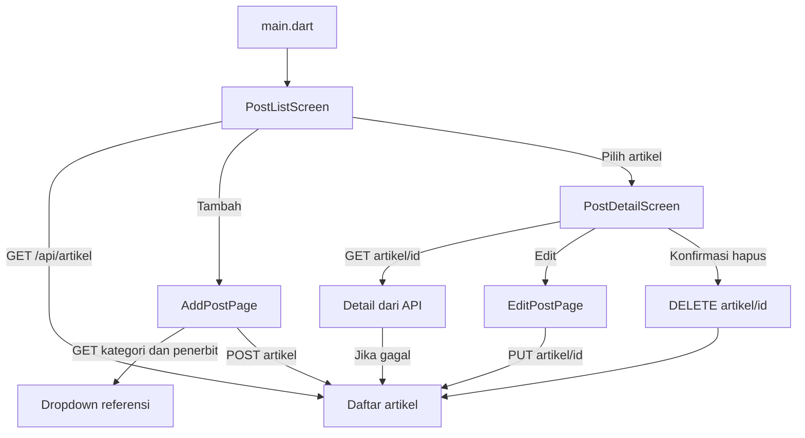

# CicipYuk Blog App

Aplikasi Flutter untuk membaca dan mengelola artikel kuliner melalui REST API.
Aplikasi ini mendukung operasi CRUD (create, read, update, delete), kategori,
penerbit, dan upload gambar artikel.

## Daftar Isi

- [Fitur](#fitur)
- [Teknologi](#teknologi)
- [Struktur Project](#struktur-project)
- [Cara Menjalankan](#cara-menjalankan)
- [Konfigurasi API](#konfigurasi-api)
- [Alur Aplikasi](#alur-aplikasi)
- [Kontrak Backend](#kontrak-backend)
- [Penjelasan Kode Penting](#penjelasan-kode-penting)
- [Validasi dan Penanganan Error](#validasi-dan-penanganan-error)
- [Troubleshooting](#troubleshooting)

## Fitur

- Menampilkan daftar artikel dari server.
- Refresh daftar artikel dengan pull-to-refresh atau setelah operasi CRUD.
- Menampilkan detail artikel.
- Menambah artikel dengan judul, kategori, penerbit, penulis, isi, dan gambar opsional.
- Mengedit artikel dan mengganti gambar.
- Menghapus artikel setelah konfirmasi pengguna.
- Memilih gambar dari galeri perangkat.
- Validasi gambar: maksimal 5 MB dan format JPG, JPEG, PNG, atau WEBP.
- Menampilkan placeholder apabila gambar kosong atau gagal dimuat.
- Menangani respons API yang berbentuk list langsung maupun `{ "data": [...] }`.

## Teknologi

| Komponen         | Penggunaan                                         |
| ---------------- | -------------------------------------------------- |
| Flutter dan Dart | Framework dan bahasa aplikasi                      |
| `http`           | Request GET, POST, PUT, dan DELETE                 |
| `http_parser`    | Menentukan MIME type gambar multipart              |
| `image_picker`   | Memilih gambar dari galeri                         |
| `google_fonts`   | Font Plus Jakarta Sans                             |
| `intl`           | Dukungan pemformatan tanggal/angka bila diperlukan |

## Struktur Project

```text
lib/
|-- main.dart                 # Entry point dan tema aplikasi
|-- api_config.dart           # Base URL dan helper normalisasi data API
`-- pages/
		|-- home_page.dart        # Daftar artikel dan navigasi utama
		|-- add_post_page.dart    # Form tambah artikel
		|-- detail_page.dart      # Detail, edit, dan hapus artikel
		`-- edit_post_page.dart   # Form edit artikel

assets/
|-- logo-cicipyuk.jpg
`-- logo-cicipyuk-clean.png
```

## Cara Menjalankan

### Prasyarat

Pastikan perangkat berikut sudah tersedia:

- Flutter SDK dengan Dart SDK yang memenuhi constraint pada `pubspec.yaml`.
- Android Studio/emulator, perangkat Android, atau target Flutter lainnya.
- Backend REST API yang aktif dan dapat dijangkau dari perangkat.
- Koneksi jaringan yang sama antara perangkat dan komputer server jika memakai IP lokal.

### Instalasi

Jalankan perintah berikut dari folder `blog_app`:

```bash
flutter pub get
flutter devices
flutter run --dart-define=API_URL=http://192.168.1.5:8000
```

`API_URL` bersifat opsional. Jika tidak diberikan, aplikasi memakai nilai default
`http://192.168.1.5:8000` yang didefinisikan di `lib/api_config.dart`.

Untuk menjalankan target tertentu, gunakan contoh berikut:

```bash
flutter run -d chrome --dart-define=API_URL=http://localhost:8000
flutter run -d windows --dart-define=API_URL=http://localhost:8000
flutter build apk --dart-define=API_URL=http://192.168.1.5:8000
```

Catatan: `localhost` dari Android emulator menunjuk ke emulator itu sendiri,
bukan komputer host. Untuk server lokal pada host, biasanya gunakan
`http://10.0.2.2:8000` pada Android emulator atau IP LAN komputer pada perangkat fisik.

## Konfigurasi API

Alamat API dibaca saat compile/run melalui `String.fromEnvironment`:

```dart
const String apiBaseUrl = String.fromEnvironment(
	'API_URL',
	defaultValue: 'http://192.168.1.5:8000',
);
```

Dengan cara ini, alamat server tidak perlu ditulis ulang di setiap halaman.
Perubahan alamat cukup dilakukan melalui `--dart-define` saat menjalankan atau
build aplikasi.

Android sudah memiliki izin internet dan mengizinkan koneksi HTTP lokal melalui
`android/app/src/main/AndroidManifest.xml`. Untuk production, sebaiknya gunakan
HTTPS dan tinjau kembali kebutuhan `usesCleartextTraffic`.

## Alur Aplikasi



Alur setelah tambah, edit, atau hapus berhasil selalu kembali ke daftar dan
memuat data ulang. Tujuannya agar tampilan tidak bergantung pada data lama di
memori halaman sebelumnya.

## Kontrak Backend

### Endpoint

| Method   | Endpoint            | Fungsi                                                    |
| -------- | ------------------- | --------------------------------------------------------- |
| `GET`    | `/api/artikel`      | Mengambil daftar artikel                                  |
| `GET`    | `/api/artikel/{id}` | Mengambil satu artikel; aplikasi punya fallback ke daftar |
| `POST`   | `/api/artikel`      | Menambah artikel                                          |
| `PUT`    | `/api/artikel/{id}` | Mengubah artikel                                          |
| `DELETE` | `/api/artikel/{id}` | Menghapus artikel                                         |
| `GET`    | `/api/kategori`     | Mengambil pilihan kategori                                |
| `GET`    | `/api/penerbit`     | Mengambil pilihan penerbit                                |

### Field Artikel

Field utama yang dikirim aplikasi:

| Field             | Tipe    | Keterangan                                     |
| ----------------- | ------- | ---------------------------------------------- |
| `judul_artikel`   | String  | Wajib, maksimal 200 karakter                   |
| `isi_artikel`     | String  | Wajib                                          |
| `id_kategori`     | Integer | Wajib, dipilih dari endpoint kategori          |
| `id_penerbit`     | Integer | Wajib, dipilih dari endpoint penerbit          |
| `penulis_artikel` | String  | Wajib, maksimal 100 karakter                   |
| `gambar_artikel`  | File    | Opsional, dikirim jika pengguna memilih gambar |

Contoh respons daftar yang didukung:

```json
[
  {
    "id": 1,
    "judul_artikel": "Resep Seblak",
    "isi_artikel": "Isi artikel...",
    "id_kategori": 2,
    "id_penerbit": 3,
    "nama_kategori": "Kuliner",
    "nama_penerbit": "CicipYuk",
    "gambar_artikel": "seblak.jpg"
  }
]
```

atau:

```json
{ "data": [ ... ] }
```

Backend juga dapat menggunakan beberapa nama alias yang ditangani aplikasi,
misalnya `title` untuk judul, `content` untuk isi, `category_id` untuk ID
kategori, serta `gambar` atau `image` untuk gambar.

### Format Request Tambah dan Edit

- Tanpa gambar: aplikasi mengirim JSON dengan `Content-Type: application/json`.
- Dengan gambar: aplikasi mengirim `multipart/form-data` dan file pada field
  `gambar_artikel`.
- Tambah menggunakan `POST /api/artikel`.
- Edit menggunakan `PUT /api/artikel/{id}`.
- Respons sukses tambah/edit dianggap valid jika statusnya `200` atau `201`.
- Respons sukses hapus dianggap valid jika statusnya `200` atau `204`.

Backend sebaiknya mengembalikan error validasi dalam format Laravel berikut agar
pesannya dapat ditampilkan dengan baik:

```json
{
  "message": "The given data was invalid.",
  "errors": {
    "judul_artikel": ["Judul wajib diisi"]
  }
}
```

## Penjelasan Kode Penting

### `api_config.dart`

File ini adalah lapisan helper bersama untuk hal-hal yang berkaitan dengan
format data API:

- `apiBaseUrl`: satu sumber alamat dasar backend.
- `gambarArtikelUrl(gambar)`: mengubah nama file menjadi URL lengkap.
  Fungsi ini juga menerima URL lengkap, path `/uploads/...`, atau nilai kosong.
- `parseKategoriId` dan `parsePenerbitId`: menormalisasi ID yang dapat datang
  sebagai integer, string, atau `Map` berisi `id`.
- `kategoriName` dan `penerbitName`: membaca nama dari beberapa nama field.
- `mediaTypeForImage`: menentukan MIME type `image/jpeg`, `image/png`, atau
  `image/webp` untuk upload.
- `pesanErrorBackend`: membaca `errors` atau `message` dari respons JSON agar
  error server menjadi pesan yang dapat dibaca pengguna.

Normalisasi ini penting karena widget tidak perlu mengulang logika pemeriksaan
format respons di setiap tempat.

### `home_page.dart`

`PostListScreen` adalah `StatefulWidget` karena daftar artikel, status loading,
dan pesan error berubah setelah request selesai.

`getArtikel()` menjalankan pola berikut:

1. Mengaktifkan loading dan menghapus error lama.
2. Memanggil `GET /api/artikel` dengan timeout 15 detik.
3. Mendukung respons berupa list langsung atau `body['data']`.
4. Menyimpan hasil dengan `setState`.
5. Menampilkan keadaan loading, error, kosong, atau daftar melalui `pilihTampilan()`.

Pemeriksaan `mounted` setelah operasi asynchronous mencegah `setState` atau
`SnackBar` dipanggil ketika halaman sudah ditutup.

### `add_post_page.dart`

Halaman tambah mengambil kategori dan penerbit saat `initState()`. Tombol simpan
memakai `Form` dan `GlobalKey<FormState>` untuk memastikan field wajib valid.

Alur pengiriman dibagi dua karena JSON tidak dapat membawa file:

```text
tanpa gambar -> http.post + jsonEncode
dengan gambar -> MultipartRequest + MultipartFile.fromPath
```

Flag `lagiMenyimpan` mencegah request ganda ketika tombol ditekan berulang kali.
Controller teks dibuang di `dispose()` agar tidak menimbulkan kebocoran resource.

### `detail_page.dart`

Halaman detail memakai dua strategi pengambilan data:

1. Mencoba `GET /api/artikel/{id}`.
2. Jika endpoint detail gagal atau tidak tersedia, mengambil seluruh daftar lalu
   mencari artikel dengan ID yang sama.

ID dibandingkan sebagai teks agar nilai `1` dan `'1'` tetap dianggap sama.
Penghapusan selalu diawali dialog konfirmasi dan hasil sukses dikirim kembali ke
halaman daftar melalui `Navigator.pop(context, true)`.

### `edit_post_page.dart`

Halaman edit mengisi controller dan dropdown dari artikel lama saat dibuka.
Fungsi `nilaiDropdownKategoriAman()` dan `nilaiDropdownPenerbitAman()` memastikan
ID lama hanya dipakai jika masih ada di data referensi terbaru. Ini mencegah
`DropdownButtonFormField` menerima nilai yang tidak ada dalam daftar item.

Untuk gambar, urutan tampilan adalah gambar baru yang dipilih, gambar lama dari
server, lalu placeholder. Jika pengguna tidak memilih gambar baru, request edit
tetap dikirim sebagai JSON sehingga gambar lama tidak perlu di-upload ulang.

## Validasi dan Penanganan Error

- Request GET memiliki timeout 15 detik.
- Request tambah/edit JSON memiliki timeout 20 detik.
- Upload multipart memiliki timeout 30 detik.
- Field wajib diperiksa sebelum request dikirim.
- Gambar diperiksa berdasarkan ukuran file dan ekstensi.
- Kegagalan koneksi, timeout, status HTTP non-sukses, dan error validasi backend
  ditampilkan melalui `SnackBar` atau pesan pada form.
- Gambar kosong atau gagal dimuat menggunakan placeholder, sehingga UI tetap
  dapat dirender.

## Troubleshooting

### `Tidak bisa konek ke server`

1. Pastikan backend sedang berjalan.
2. Pastikan `API_URL` menunjuk ke IP dan port yang benar.
3. Pastikan perangkat dan komputer server berada di jaringan yang sama.
4. Periksa firewall dan izin koneksi HTTP.
5. Pada Android emulator, coba `10.0.2.2` untuk mengakses localhost komputer.

### Daftar kosong padahal backend memiliki data

- Periksa apakah respons endpoint berupa list atau memiliki key `data`.
- Pastikan setiap item memiliki `id` atau `id_artikel`.
- Pastikan endpoint yang dipakai sama dengan endpoint pada tabel kontrak.

### Gambar tidak tampil

- Pastikan nilai `gambar_artikel` adalah nama file, path yang benar, atau URL lengkap.
- Pastikan file tersedia pada folder upload backend.
- Pastikan `API_URL` dapat diakses dari perangkat, bukan hanya dari komputer server.
- Periksa bahwa backend mengizinkan request HTTP jika belum menggunakan HTTPS.

### Dropdown kategori atau penerbit kosong

- Pastikan `GET /api/kategori` dan `GET /api/penerbit` dapat diakses.
- Pastikan setiap item memiliki `id` atau `id_kategori`/`id_penerbit`.
- Pastikan nama item menggunakan `nama_kategori`/`nama_penerbit` atau alias `name`.

## Pemeriksaan Kode

Gunakan perintah berikut sebelum commit:

```bash
flutter analyze
flutter test
```

`flutter analyze` memeriksa error dan lint Dart, sedangkan `flutter test`
menjalankan pengujian yang ada di folder `test/`.
